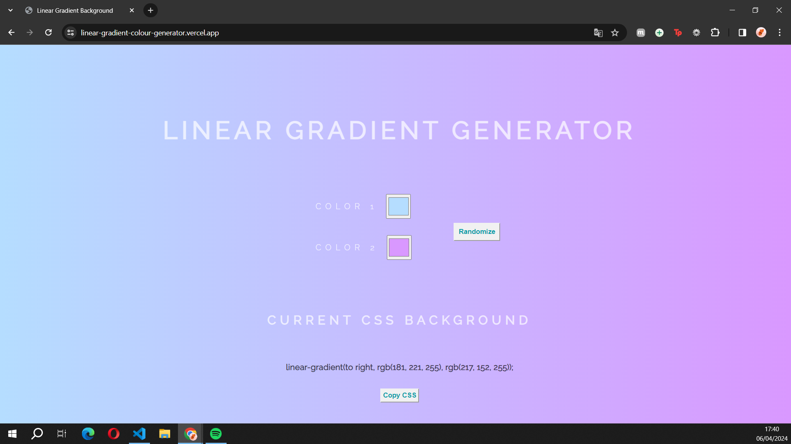

# Linear Gradient Background

Linear Gradient Generator with the click of a button!

## Description

This project is a simple linear gradient background generator. Users can select two colors using color pickers, and the application generates a linear gradient background using those colors. There's also an option to randomize the colors. Users can copy the generated CSS code to use it in their projects.

## Screenshot

## Usage

1. Clone the repository: `git clone https://github.com/your-username/linear-gradient-background.git`
2. Open `index.html` in your web browser.

## How to Contribute

Contributions are welcome! Here's how you can contribute:

1. Fork the repository
2. Create a new branch (`git checkout -b feature`)
3. Make changes and commit them (`git commit -am 'Add new feature'`)
4. Push to the branch (`git push origin feature`)
5. Create a pull request

